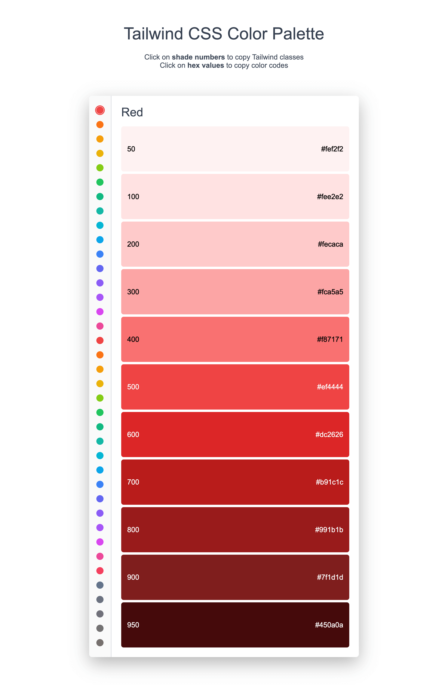

# Tailwind CSS Color Palette

An interactive color palette viewer for Tailwind CSS that makes it easy to browse and copy color values for your projects.



## Features

- **Dual Copy Modes**
  - Click on shade numbers (50, 100, 200, etc.) to copy Tailwind class names (e.g., `red-500`)
  - Click on hex values to copy color codes (e.g., `#ef4444`)

- **Complete Color Collection**
  - All Tailwind CSS color palettes
  - 11 shades per color (50, 100, 200, 300, 400, 500, 600, 700, 800, 900, 950)
  - Organized with vibrant colors first, neutral colors at the bottom

- **Beautiful Interface**
  - Smooth animations and hover effects
  - Automatic text contrast for readability
  - Responsive design for mobile and desktop
  - Copy confirmation feedback

- **Zero Dependencies**
  - Pure vanilla JavaScript
  - No frameworks or libraries required

## Usage

1. **Select a color** - Click on any color circle in the left sidebar
2. **Copy Tailwind class** - Click on the shade number (e.g., "500") to copy the Tailwind class name like `red-500`
3. **Copy hex value** - Click on the hex code (e.g., "#ef4444") to copy the color value

## Colors Included

### Chromatic Colors
- Red, Orange, Amber, Yellow, Lime
- Green, Emerald, Teal, Cyan, Sky
- Blue, Indigo, Violet, Purple, Fuchsia
- Pink, Rose

### Neutral Colors
- Slate, Gray, Zinc, Neutral, Stone

## Installation

Simply download and open the HTML file in any modern web browser. The code is intentionally kept simple and dependency-free:. No build process required.

```bash
# Clone or download the file
open index.html
```

## Development

The code is intentionally kept simple and dependency-free:
- **HTML**: Single file with embedded CSS and JavaScript
- **JavaScript**: Vanilla JS with modern features
- **CSS**: Clean, responsive styles with smooth transitions

## Customization

Want to modify the color palette? Edit the `tailwindColors` array in the JavaScript section:

```javascript
const tailwindColors = [
  {
    name: 'Your Color',
    shades: [
      { weight: 50, hex: '#ffffff' },
      { weight: 100, hex: '#f0f0f0' },
      // ... more shades
    ]
  }
];
```

## Credits

- Color values from [Tailwind CSS](https://tailwindcss.com/docs/customizing-colors)

## License

MIT License

## Contributing

Found a bug or have a suggestion? Feel free to open an issue or submit a pull request.

---

Made with ❤️ for the Tailwind CSS community